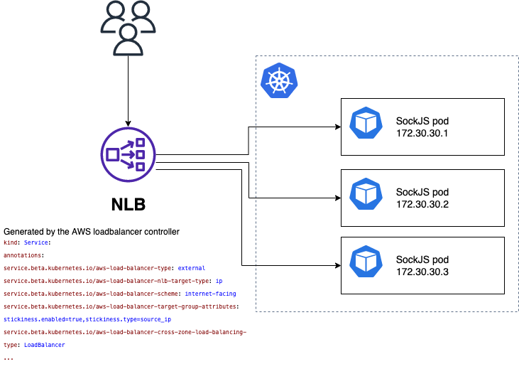

# SockJS-test
This demo shows how to achieve session stickiness for SockJS on AWS. 
The stickiness is based on source IP and doesn't require any special configuration of the SockJS client.

The demo is based on the SockJS example app [Echo](https://github.com/sockjs/sockjs-node/tree/main/examples/echo)

The full architecture uses:
- [EKS](https://docs.aws.amazon.com/eks/latest/userguide/what-is-eks.html) (Installed using eksctl)
- [AWS Loadbalancer Controller](https://docs.aws.amazon.com/eks/latest/userguide/aws-load-balancer-controller.html)
- [NLB](https://docs.aws.amazon.com/elasticloadbalancing/latest/network/introduction.html) (AWS Network Loadbalancer)

## Behind the scenes
The network loadbalancer gets deployed automatically when the service.yaml is applied onto the kubernetes cluster by the AWS Loadbalancer controller. The loadbalancer will be continuously updated with new targets/pods when new pods are created/destroyed. The NLB has been annotated with some settings that tell it to keep the sessions sticky based on source IP ```service.beta.kubernetes.io/aws-load-balancer-target-group-attributes: stickiness.enabled=true,stickiness.type=source_ip```

## Architecture
